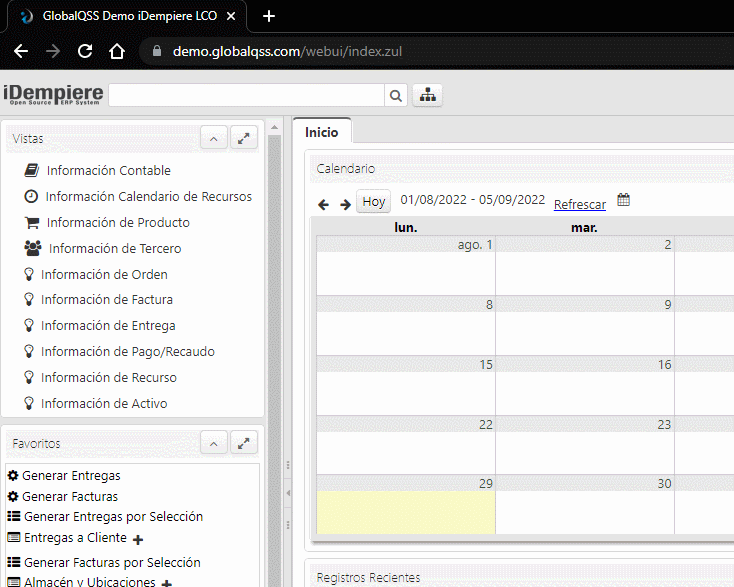
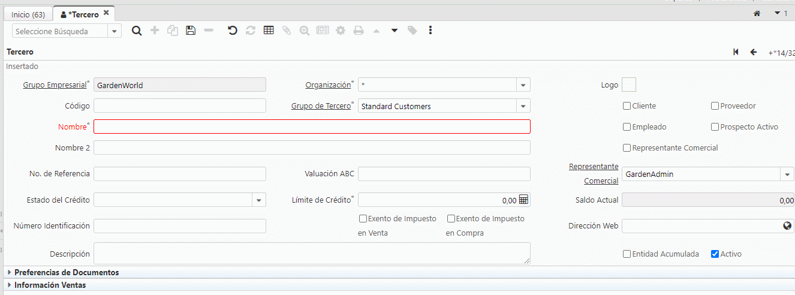

# Creación de terceros
---
prueba de libro [book](book/index.html)
>La pestaña **[tercero](https://wiki.idempiere.org/es/Configuracion_de_terceros#:~:text=Un%20tercero%20en%20iDEMPIERE%20es,informaci%C3%B3n%20en%20una%20sola%20ficha.)** define las entidades con las cuales una organización se relaciona para los negocios. ejemplo: Clientes, Proveedores, Empleados, Representantes comerciales.

Hay varias formas de crear un tercero, a continuación se explica la forma mas rápida:

Siga los siguientes pasos:
* Digite la palabra tercero en el menú de búsqueda principal: 

* Presione el icono con el signo (+).

- Ingrese los datos del tercero en la ventana que aparece 

- Presione botón guardar.

|*Preguntas frecuentes*|
|:-|
|¿como creo un cliente?|
|¿como creo un proveedor?|
|¿donde se registra un tercero?|